# Exercices Python - Cours 03 (corrigé)

Les exercices sont regroupés selon les fiches du cours et se font dans l'ordre.

**Légende des niveaux de difficulté :** 🟢 Facile · 🟡 Moyen · 🔴 Avancé · 🟣 Synthèse

| Fiche | Sujet | Exercices | 🟢 | 🟡 | 🔴 |
| --- | --- | :---: | :---: | :---: | :---: |
| 3.1 | Entrées en console | 1 à 6 | 3 | 2 | 1 |
| 3.2 | Sorties en console | 7 à 12 | 4 | 1 | 1 |
| 3.3 | Sorties en console - formatage avancé | 13 à 18 | 2 | 3 | 1 |
| 3.4 | Opérateurs relationnels et logiques | 19 à 26 | 4 | 2 | 2 |
| — | **Exercice synthèse** 🟣 | 27 | | | |

---

## 3.1 - Entrées en console

### Exercice 1 — 🟢 Facile

Demande à l'utilisateur son prénom et affiche : `Bonjour <prénom> !`.

Résultat:  
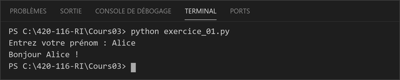

```python
prenom = input("Entrez votre prénom : ")
print(f"Bonjour {prenom} !")
```

### Exercice 2 — 🟢 Facile

Demande à l'utilisateur deux nombres et affiche leur somme.

Résultat:  
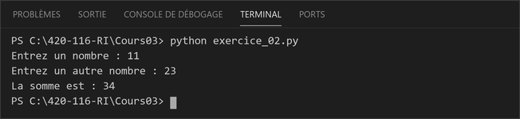

```python
a = int(input("Entrez un nombre : "))
b = int(input("Entrez un autre nombre : "))
print(f"La somme est : {a + b}")
```

### Exercice 3 — 🟢 Facile

Demande l'âge de l'utilisateur et affiche `Tu as X ans.`.

Résultat:  
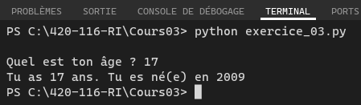

```python
ANNEE_COURANTE = 2026
age = int(input("Quel est ton âge ? "))
print(f"Tu as {age} ans. Tu es né(e) en {ANNEE_COURANTE - age}.")
```

### Exercice 4 — 🟡 Moyen

Demande un prix unitaire (nombre décimal) et une quantité (nombre entier), puis affiche le total à payer.

Résultat:  
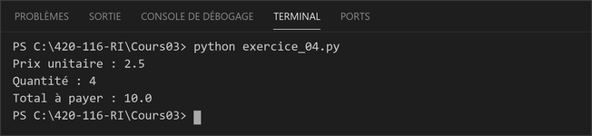

```python
prix_unitaire = float(input("Prix unitaire : "))
quantite = int(input("Quantité : "))
total = prix_unitaire * quantite
print(f"Total à payer : {total}")
```

### Exercice 5 — 🟡 Moyen

Demande trois notes et affiche leur moyenne.

Résultat:  
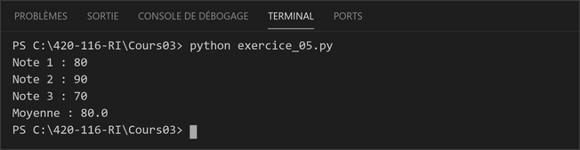

```python
note1 = float(input("Note 1 : "))
note2 = float(input("Note 2 : "))
note3 = float(input("Note 3 : "))
moyenne = (note1 + note2 + note3) / 3
print(f"Moyenne : {moyenne}")
```

### Exercice 6 — 🔴 Avancé

Demande une température en degrés Celsius et affiche sa conversion en degrés Fahrenheit.

Résultat:  
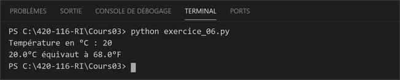

```python
celsius = float(input("Température en °C : "))
fahrenheit = celsius * 9 / 5 + 32
print(f"{celsius}°C équivaut à {fahrenheit}°F")
```

*Remarque : à cause de la priorité des opérateurs, `celsius * 9 / 5 + 32` est équivalent à `((celsius * 9) / 5) + 32` — la multiplication et la division se font avant l'addition.*

---

## 3.2 - Sorties en console

### Exercice 7 — 🟢 Facile

Écris un programme qui affiche ton prénom et ton nom sur deux lignes en un seul appel à `print()`.

Résultat:  
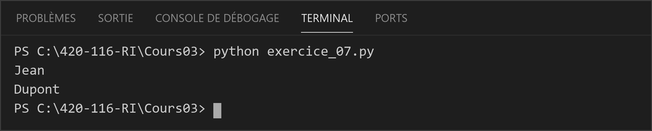

```python
prenom, nom = "Jean", "Dupont"
print(prenom + "\n" + nom)
```

### Exercice 8 — 🟢 Facile

Affiche la phrase : `Bonjour, je m'appelle Alice et j'ai 20 ans.` à l'aide d'une f-string.

Résultat:  
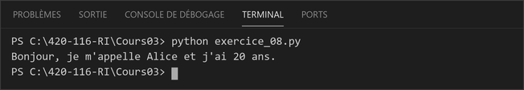

```python
nom = "Alice"
age = 20
print(f"Bonjour, je m'appelle {nom} et j'ai {age} ans.")
```

### Exercice 9 — 🟢 Facile

Affiche un carré formé d'étoiles `*` (4x4).

Résultat:  
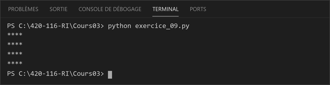

```python
print("****")
print("****")
print("****")
print("****")
# ou encore
print("****\n" * 4)
```

### Exercice 10 — 🟢 Facile

Affiche les nombres de 1 à 5, chacun sur une ligne.

Résultat:  
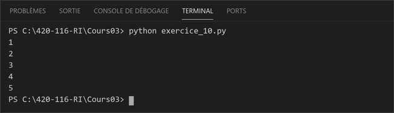

```python
print(1)
print(2)
print(3)
print(4)
print(5)
# vivement les boucles!!
```

### Exercice 11 — 🟡 Moyen

Affiche un triangle d'étoiles croissant, de 1 à 5 étoiles (une ligne par `print()`).

Résultat:  
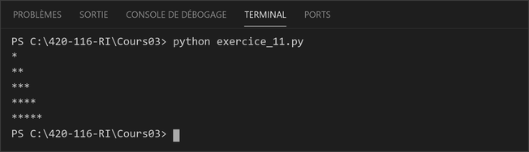

```python
print("*")
print("**")
print("***")
print("****")
print("*****")
# vivement les boucles!!
```

### Exercice 12 — 🔴 Avancé

Affiche les 5 premières lignes de la table de multiplication de 5, en un seul appel à `print()`.

Résultat:  
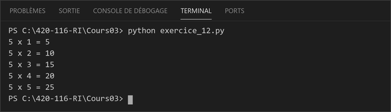

```python
# Rappelez-vous que pour mettre une instruction sur plusieurs lignes, on utilise les ()
table = (
    "5 x 1 = 5\n"
    "5 x 2 = 10\n"
    "5 x 3 = 15\n"
    "5 x 4 = 20\n"
    "5 x 5 = 25"
)
print(table)
```

*Remarque : en enveloppant les chaînes entre parenthèses, Python les concatène automatiquement en une seule chaîne — pratique pour construire un texte multi-lignes lisible sans `+`.*

---

## 3.3 - Sorties en console - formatage avancé

### Exercice 13 — 🟢 Facile

Affiche le nombre `42` aligné à droite dans un champ de 6 caractères, encadré par des barres `|`.

Résultat:  
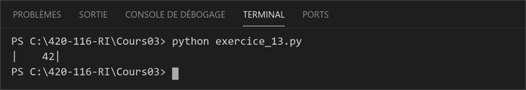

```python
n = 42
print(f"|{n:>6}|")
```

### Exercice 14 — 🟢 Facile

Affiche le mot `Python` aligné à gauche dans un champ de 12 caractères, entre crochets `[ ]`.

Résultat:  
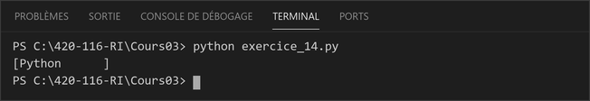

```python
mot = "Python"
print(f"[{mot:<12}]")
```

### Exercice 15 — 🟡 Moyen

Affiche le message `Bienvenue dans le cours de Python !` centré dans un tableau d'étoiles de 10 lignes.

Résultat:  
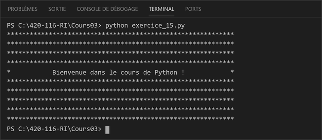

```python
etoiles = "*" * 60

print(etoiles)
print(etoiles)
print(etoiles)
print(etoiles)
print(f"*{'Bienvenue dans le cours de Python !':^58}*")
print(etoiles)
print(etoiles)
print(etoiles)
print(etoiles)
print(etoiles)
```

*Remarque : le spécificateur `^58` centre le message dans un champ de 58 caractères, entre les deux étoiles des extrémités — le tableau reste donc parfaitement aligné sur 60 caractères.*

### Exercice 16 — 🟡 Moyen

Affiche un prix de `19.9` formaté avec exactement 2 décimales, précédé du symbole `$`.

Résultat:  
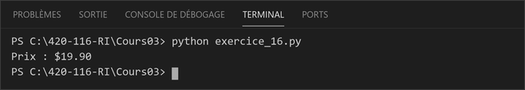

```python
prix = 19.9
print(f"Prix : ${prix:.2f}")
```

### Exercice 17 — 🟡 Moyen

Affiche l'identifiant `42` sur 5 chiffres, complété par des zéros devant.

Résultat:  
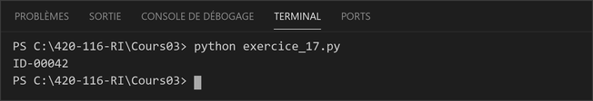

```python
identifiant = 42
print(f"ID-{identifiant:05}")
```

### Exercice 18 — 🔴 Avancé

Affiche un petit reçu pour 3 produits, avec les noms alignés à gauche et les prix alignés à droite avec 2 décimales.

Résultat:  
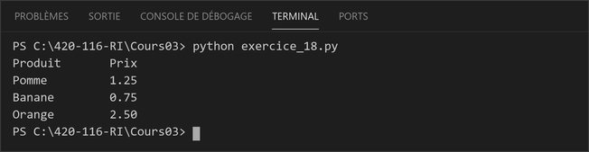

```python
print(f"{'Produit':<10}{'Prix':>8}")
print(f"{'Pomme':<10}{1.25:>8.2f}")
print(f"{'Banane':<10}{0.75:>8.2f}")
print(f"{'Orange':<10}{2.50:>8.2f}")
```

---

## 3.4 - Opérateurs relationnels et logiques

### Exercice 19 — 🟢 Facile

Demande deux nombres et affiche `True` ou `False` si (a > b) et (b > a).

Résultat:  
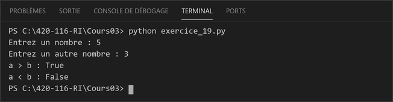

```python
a = int(input("Entrez un nombre : "))
b = int(input("Entrez un autre nombre : "))
print(f"a > b : {a > b}")
print(f"a < b : {a < b}")
```

### Exercice 20 — 🟢 Facile

Demande un nombre et affiche `True` ou `False` si le nombre est positif.

Résultat:  
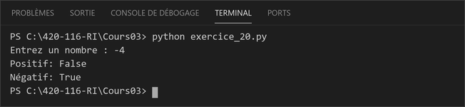

```python
n = int(input("Entrez un nombre : "))
print(f"Positif: {n > 0}")
print(f"Négatif: {n < 0}")
```

### Exercice 21 — 🟢 Facile

Demande un nombre et affiche `True` ou `False` si un nombre est pair ou impair.

Résultat:  
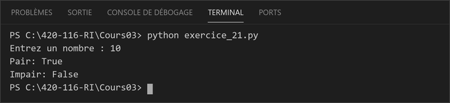

```python
n = int(input("Entrez un nombre : "))
print(f"Pair: {n % 2 == 0}")
print(f"Impair: {n % 2 == 1}")
```

### Exercice 22 — 🟢 Facile

Demande l'âge et affiche `True` ou `False` si la personne est majeure (>=18).

Résultat:  
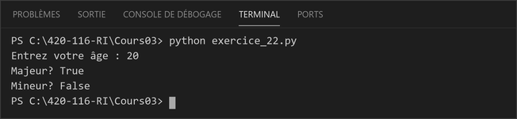

```python
age = int(input("Entrez votre âge : "))
print(f"Majeur? {age >= 18}")
print(f"Mineur? {age < 18}")
```

### Exercice 23 — 🟡 Moyen

Demande un nombre et affiche `True` ou `False` s'il est compris entre 10 et 20.

Résultat:  
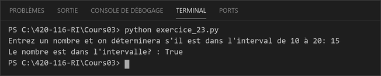

```python
n = int(input("Entrez un nombre et on déterminera s'il est dans l'interval de 10 à 20: "))
print(f"Le nombre est dans l'intervalle? : {10 <= n <= 20}")
```

*Remarque : `10 <= n <= 20` est une comparaison enchaînée — une fonctionnalité pratique de Python.*

### Exercice 24 — 🔴 Avancé [Niveau expert]

Demande un caractère et vérifie s'il s'agit d'une voyelle (a, e, i, o, u).

Résultat:  
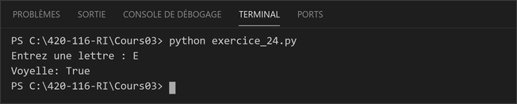

```python
c = input("Entrez une lettre : ")

# Vérification de la voyelle (en minuscule)
voyelle = c.lower() in "aeiou"

print(f"Voyelle: {voyelle}")
```

*Remarque : l'opérateur `in` de Python permet de vérifier si un caractère fait partie d'une chaîne, en une seule expression concise. `.lower()` convertit en minuscule pour couvrir les majuscules aussi, évitant de lister chaque cas.*

### Exercice 25 — 🟡 Moyen

Demande un nombre et vérifie s'il est multiple de 3 ou de 5.

Résultat:  
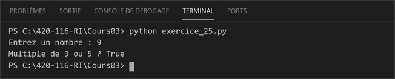

```python
n = int(input("Entrez un nombre : "))
print(f"Multiple de 3 ou 5 ? {n % 3 == 0 or n % 5 == 0}")
```

### Exercice 26 — 🔴 Avancé

Vérifie si une année entrée est bissextile.

Résultat:  
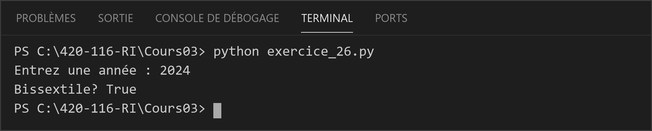

```python
annee = int(input("Entrez une année : "))
print(f"Bissextile? {(annee % 4 == 0 and annee % 100 != 0) or annee % 400 == 0}")
```

---

## Exercice synthèse — 🟣 Générateur de carte de personnage RPG

### Exercice 27

Tu développes un petit outil pour un jeu de rôle : un générateur de **carte de personnage**. Ce programme doit combiner tout ce qui a été vu dans le Cours 03 — entrées, sorties, formatage et opérateurs logiques.

Résultat:  
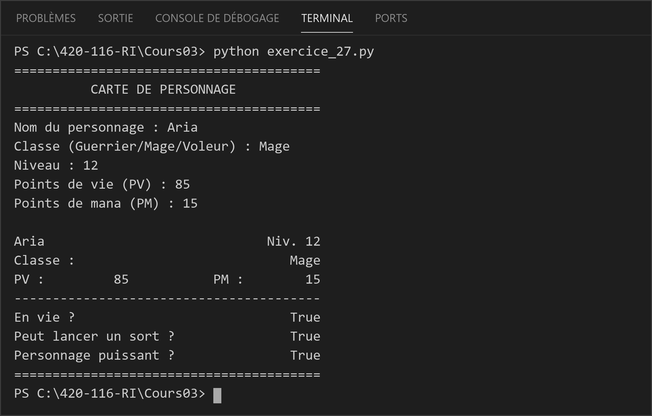

```python
print("=" * 40)
print(f"{'CARTE DE PERSONNAGE':^40}")
print("=" * 40)

nom = input("Nom du personnage : ")
classe = input("Classe (Guerrier/Mage/Voleur) : ")
niveau = int(input("Niveau : "))
pv = int(input("Points de vie (PV) : "))
mana = int(input("Points de mana (PM) : "))

en_vie = pv > 0
peut_lancer_sort = (classe.lower() == "mage") and (mana >= 10)
est_puissant = (niveau >= 10) or (pv >= 100)

print()
print(f"{nom:<25}{'Niv. ' + str(niveau):>15}")
print(f"{'Classe :':<10}{classe:>30}")
print(f"{'PV :':<10}{pv:>5}{'PM :':>15}{mana:>10}")
print("-" * 40)
print(f"{'En vie ?':<30}{str(en_vie):>10}")
print(f"{'Peut lancer un sort ?':<30}{str(peut_lancer_sort):>10}")
print(f"{'Personnage puissant ?':<30}{str(est_puissant):>10}")
print("=" * 40)
```

*Remarque : chaque ligne de la carte totalise 40 caractères (`<25`+`>15`, `<10`+`>30`, `<10`+`>5`+`>15`+`>10`, `<30`+`>10`), ce qui garde la carte parfaitement alignée peu importe les valeurs affichées. `and`/`or` combinent ici plusieurs comparaisons pour produire les trois indicateurs booléens de la carte.*
